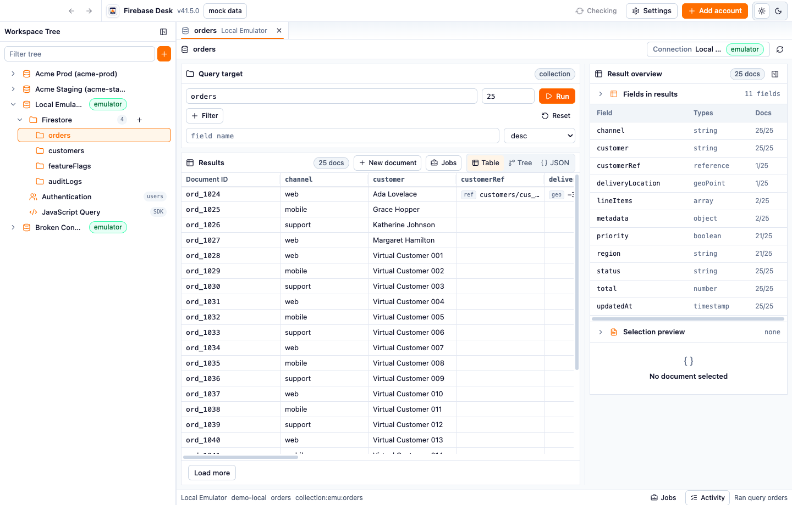

# Firebase Desk

Free, open-source desktop app for Firebase admin/data workflows.

Use it to browse and edit Firestore data, inspect Authentication users, connect local emulators, and run JavaScript admin scripts from a focused Electron app. Try the browser demo with safe sample data before installing.



## Why

Firebase Desk is for developers who need a direct workbench for Firebase projects without a hosted SaaS subscription. Mock mode and the browser demo let first-time users explore with local sample data before connecting an emulator or production project.

## Features

- Mock mode with local sample data and first-run guide.
- Static browser demo backed by mock repositories.
- Multiple Firebase accounts for dev, emulator, and production workflows.
- Workspace tree, tabs, project switcher, command palette, and keyboard shortcuts.
- Firestore query builder with filters, sorting, limits, pagination, and table/tree/JSON result views.
- Firestore document creation, full JSON editing, field editing, stale-write handling, and conflict merge.
- Subcollection discovery, document deletes, and collection copy/duplicate/export/import/delete jobs.
- Authentication user list, UID/email filtering, detail view, pagination, and custom claims editing.
- JavaScript Query workbench for trusted Firebase Admin SDK scripts with results, logs, errors, and cancellation.
- Jobs drawer, activity log, status bar, loading, empty, and error states.
- Local settings for theme, density, mock/live mode, activity retention, stale-write behavior, saved table layouts, field catalogs, and credential storage.

See the full feature inventory in the docs: <https://fdql.github.io/fdql/docs/features/>

## Docs

- Website: <https://fdql.github.io/fdql/>
- Browser demo: <https://fdql.github.io/fdql/demo/>
- Docs: <https://fdql.github.io/fdql/docs/>
- Getting started: <https://fdql.github.io/fdql/docs/getting-started/>
- Features: <https://fdql.github.io/fdql/docs/features/>
- Safety: <https://fdql.github.io/fdql/docs/safety/>
- Troubleshooting: <https://fdql.github.io/fdql/docs/troubleshooting/>

## Downloads

- Latest release: <https://github.com/fdql/fdql/releases/tag/latest>
- Versioned releases: <https://github.com/fdql/fdql/releases>

Release binaries are unsigned development builds. Verify checksums before opening downloaded packages:

```sh
shasum -a 256 -c SHA256SUMS*.txt
```

## Safety

- Mock mode uses local fixtures only.
- Emulator mode connects to hosts you configure.
- Production mode uses service account credentials and can write to real Firebase projects.
- Destructive operations require explicit user action, but credentials still control access.

## Development

```sh
pnpm install
pnpm build
pnpm test
```

Preferred root checks:

```sh
pnpm format:check
pnpm lint
pnpm typecheck
pnpm test
pnpm build
```

Docs:

```sh
pnpm docs:build
pnpm docs:dev
pnpm docs:smoke
pnpm docs:screenshots
```

## Repo Layout

- `apps/desktop`: Electron main, preload, and renderer integration.
- `apps/docs`: GitHub Pages docs site.
- `apps/storybook`: UI review and interaction stories.
- `packages/ui`: domain-free primitives.
- `packages/product-ui`: Firebase-aware UI and feature surfaces.
- `packages/repo-contracts`: shared contracts and value shapes.
- `packages/ipc-schemas`: zod validation for IPC boundaries.
- `packages/repo-firebase`: live Firebase Admin repositories.
- `packages/repo-mocks`: mock repositories and fixtures.
- `packages/script-runner`: JavaScript query runner.
- `e2e`: Electron Playwright coverage and docs screenshot capture.

MIT licensed. Firebase Desk is not affiliated with Google or Firebase.
