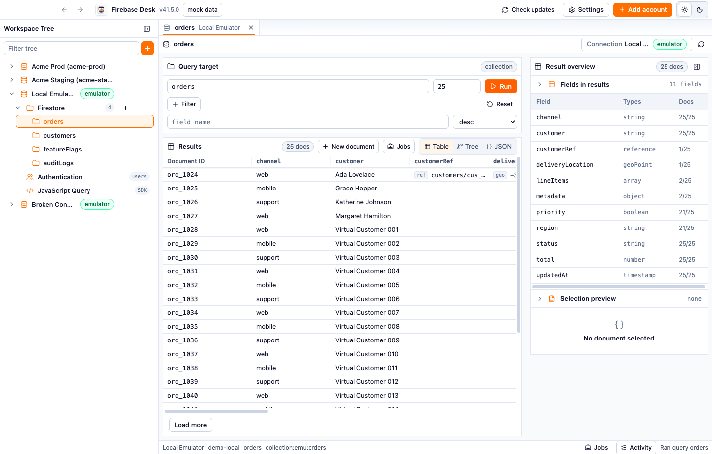

# Firebase Desk

Free, open-source desktop app for Firebase admin/data workflows.

Use it to browse and edit Firestore data, inspect Authentication users, connect local emulators, and run JavaScript admin scripts from a focused Electron app.



## Why

Firebase Desk is for developers who need a direct workbench for Firebase projects without a hosted SaaS subscription. It starts in mock mode, so first-time users can explore the app with local demo data before connecting an emulator or production project.

## Features

- Mock mode with local sample data and first-run guide.
- Multiple Firebase accounts and local emulator profiles.
- Firestore collection browser with filters, sorting, limits, pagination, and table/tree/JSON result views.
- Firestore document create and edit workflows.
- Authentication user list, filtering, detail view, and custom claims editing.
- JavaScript Query surface for trusted Firebase Admin SDK scripts.
- Jobs, activity log, loading, empty, and error states.
- Local settings and secure credential storage where the OS supports it.

## Docs

- Docs site: <https://viniciusrmcarneiro.github.io/firebase-desk/>
- Getting started: <https://viniciusrmcarneiro.github.io/firebase-desk/getting-started.html>
- Features: <https://viniciusrmcarneiro.github.io/firebase-desk/features.html>
- Safety: <https://viniciusrmcarneiro.github.io/firebase-desk/safety.html>
- Troubleshooting: <https://viniciusrmcarneiro.github.io/firebase-desk/troubleshooting.html>

## Downloads

- Latest release: <https://github.com/viniciusrmcarneiro/firebase-desk/releases/tag/latest>
- Versioned releases: <https://github.com/viniciusrmcarneiro/firebase-desk/releases>

Release binaries are unsigned development builds. Verify checksums before opening downloaded packages:

```sh
shasum -a 256 -c SHA256SUMS*.txt
```

## Safety

- Mock mode uses local fixtures only.
- Emulator mode connects to hosts you configure.
- Production mode uses service account credentials and can write to real Firebase projects.
- Destructive operations require explicit user action, but credentials still control access.

## Development

```sh
pnpm install
pnpm build
pnpm test
```

Preferred root checks:

```sh
pnpm format:check
pnpm lint
pnpm typecheck
pnpm test
pnpm build
```

Docs:

```sh
pnpm docs:build
pnpm docs:screenshots
```

## Repo Layout

- `apps/desktop`: Electron main, preload, and renderer integration.
- `apps/docs`: GitHub Pages docs site.
- `apps/storybook`: UI review and interaction stories.
- `packages/ui`: domain-free primitives.
- `packages/product-ui`: Firebase-aware UI and feature surfaces.
- `packages/repo-contracts`: shared contracts and value shapes.
- `packages/ipc-schemas`: zod validation for IPC boundaries.
- `packages/repo-firebase`: live Firebase Admin repositories.
- `packages/repo-mocks`: mock repositories and fixtures.
- `packages/script-runner`: JavaScript query runner.
- `e2e`: Electron Playwright coverage and docs screenshot capture.

MIT licensed. Firebase Desk is not affiliated with Google or Firebase.
